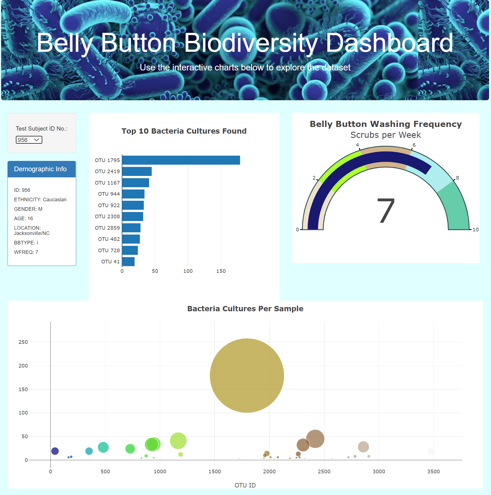

  

# Belly Button Biodiversity Dashboard

There are many different types of bacteria that can be found on the body and that bacteria may vary on a single person depending upon the location on the body or from person to person.  The dataset provided for this exploration was collected from the belly buttons of 153 anonymous test subjects.  
    
“Test Subject ID No.” is a selector switch that allows the user to select one of the 153 test subjects.
    
“Demographic Info” displays the demographic information of the selected test subject.  The demographic information includes the test subject’s ID, ethnicity, gender, age, location (City, ST), BBType (belly button type) and WFreq (belly button washing frequency).
    
“Top 10 Bacteria Cultures Found” displays each of the top ten bacteria cultures of dataset that are found in the test subject’s belly button and value associated with it.  Some of the test subjects do not have all of the top ten bacteria cultures.
    
“Belly Button Washing Frequency” is a gauge chart to visualize number of times per week that the test subject washes their belly button.
    
“Bacteria Cultures per Sample” shows all the bacteria cultures found on the selected test subject.  Each marker represents a different culture.  Hover over the marker to discover its OTU ID No., value, and species name.  The size of the marker is relative to the value.
